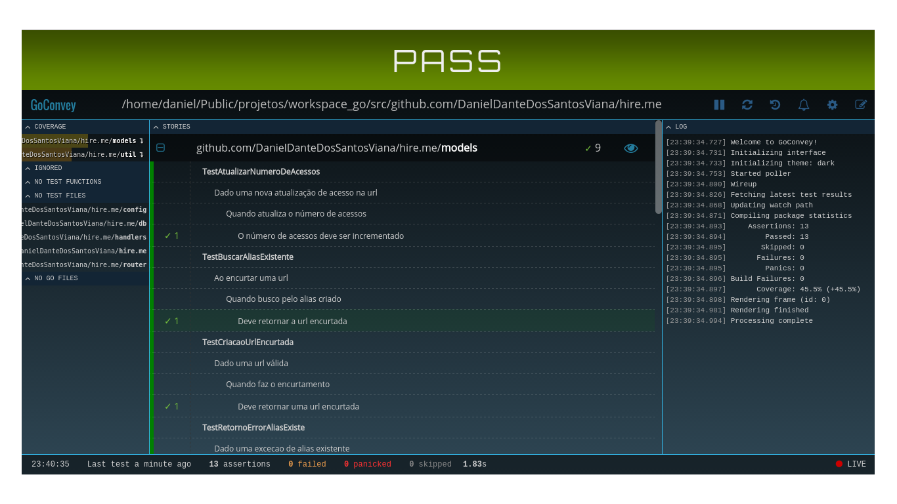

# Encurtador URL
[](https://api.travis-ci.org/DanielDanteDosSantosViana/hire.me.svg?branch=master)

# Instalando todas as dependências
```
   go get ./...
```
# Instalação
```
   na raiz do projeto:

   go install
```

# Modo de usar

Para utilizar o encurtador basta rodar em linha de comando:
```
   go run main.go

```

Existe um arquivo de configuração default utilizado no projeto chamado
conf.toml, porém pode se passar em linha de comando o caminho para outro
arquivo de configuração:
```
   go run main.go -config [path]

```

# Arquivo de configuração

O arquivo de configuração é essencial para o projeto, pois nele estão as
referências para os acessos na base, porta do serviço e a string para o cálculo
de conversão de int64 para o alias(ulr encurtada).

Arquivo config default:
```
[service]
port = ":8081"
host = "http://localhost:8081/url/"

[db]
mysqlread =  "root:1234@/encurtar_url?charset=utf8"
mysqlwrite = "root:1234@/encurtar_url?charset=utf8"

[base]
alfabeto="abcdefghijklmnopqrstuvwxyzABCDEFGHIJKLMNOPQRSTUVWXYZ0123456789"

```
Existem dois acessos de banco, mysqlread(onde colocaria o usuário com apenas permissão de leitura) e
mysqlwrite(usuário com permissão de escrita). A ideia inicial era deixar o banco de leitura com Redis, para cachear as consultas.

#Banco
```
MySQL

Obs:
  - o schema do banco está no arquivo schema.sql

  - para a geração do alias de encurtamento , foi utilizado a seguinte ideia obtida no
    stackoverflow : http://stackoverflow.com/questions/742013/how-to-code-a-url-shortener

  - para a geração de um inteiro único para cada alias :
   http://code.flickr.net/2010/02/08/ticket-servers-distributed-unique-primary-keys-on-the-cheap/

```


# Teste

Para rodar todos os teste é necessário o seguinte  comando :
```
    na raiz do projeto:

    go test -v ./...

```
No projeto está sendo utilizado o goconvey(https://github.com/smartystreets/goconvey.git), então
você pode acessar  :
```
 $ $GOPATH/bin/goconvey
```
Os resultados dos testes serão mostrados na seguinte url:
```
http://localhost:8080

```

Conforme a imagem :

  
